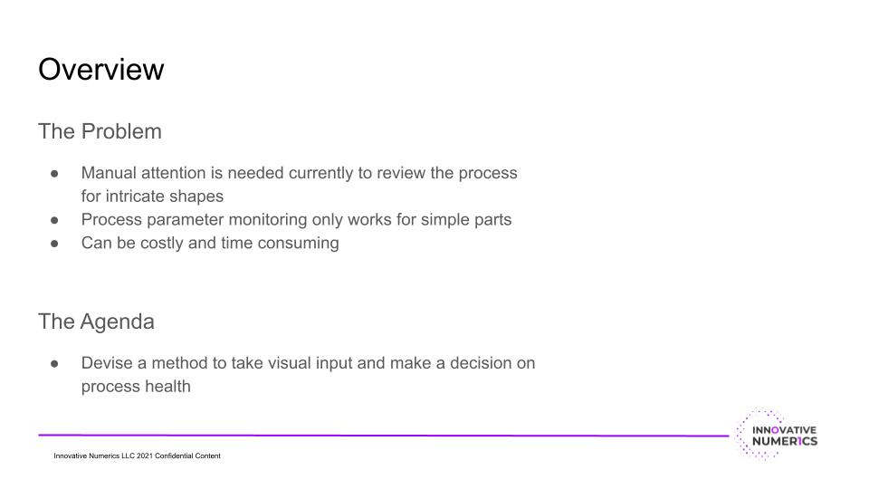
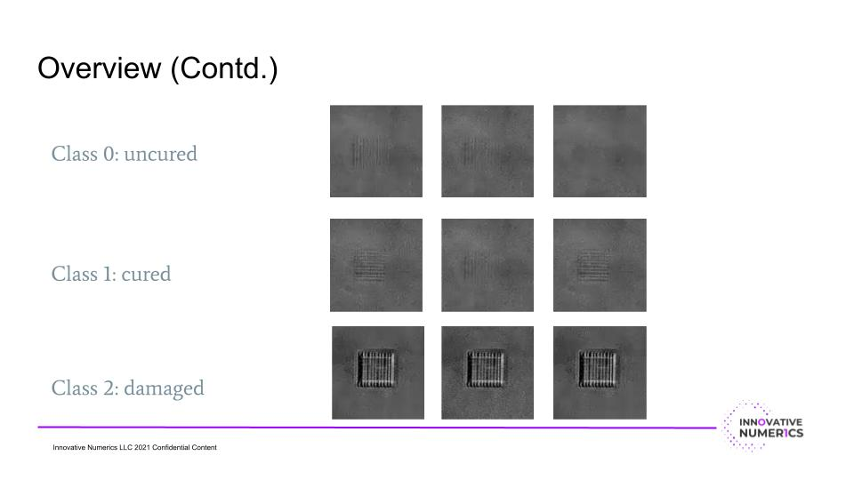
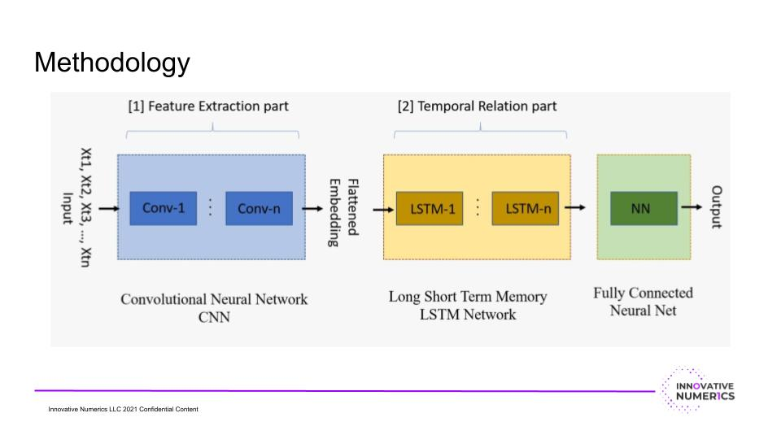
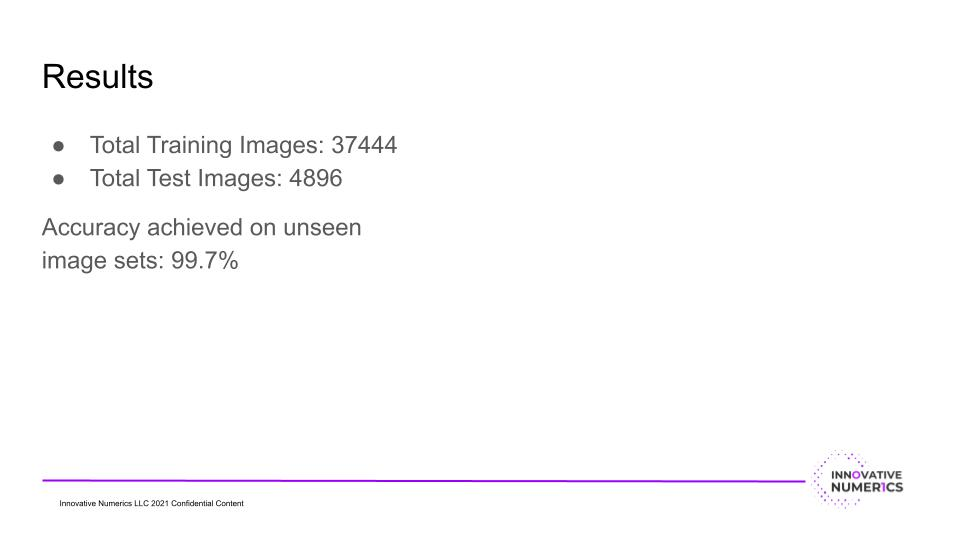

# Lithography_Defect_Detection
CNN-LSTM model trained for time series image classification during Lithography process. 
Attached is the problem description and the results obtained. This repository only contains the code in .py file format used to obtain these results.
The following slides describe the projects and results.

*****

*****

*****

